# CoffeeStoreManager
___

**GIỚI THIỆU**

CoffeeStoreManager là phần mềm giúp chủ sở hữu hoặc người quản lý những quán cafe vừa và nhỏ quản lý quán một cách tiện lợi và dễ dàng hơn.

***

**ĐIỀU KIỆN**

Thiết lập file database theo file [docx](https://docs.google.com/document/d/1omH-9nghcgK9ok7s1X4YNy2XQJ0YOPWBXRHRdkWHt88/edit)

***

**CÁCH CÀI ĐẶT**

Chạy file CoffeeManager.msi

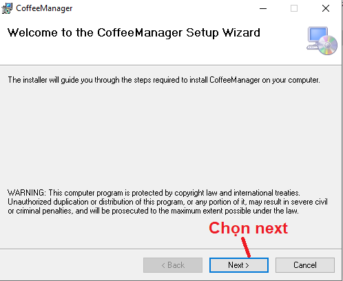
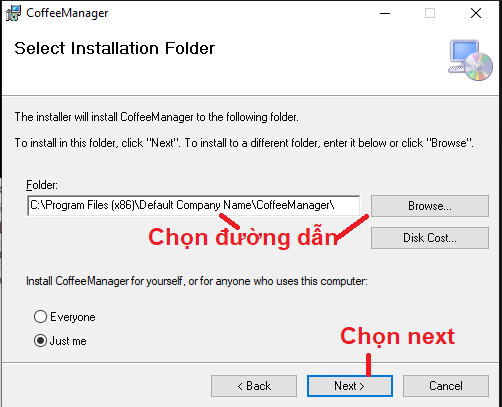
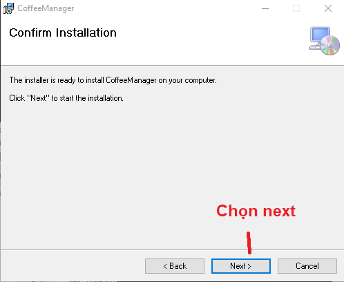
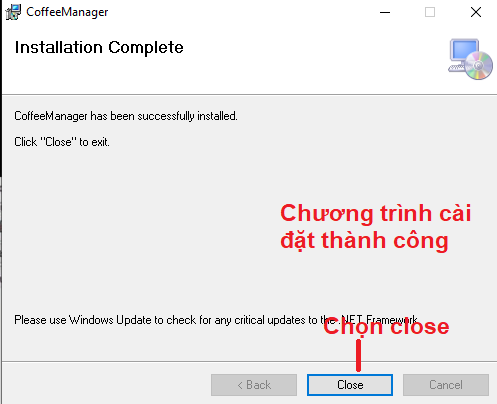

***

**CÁCH SỬ DỤNG**

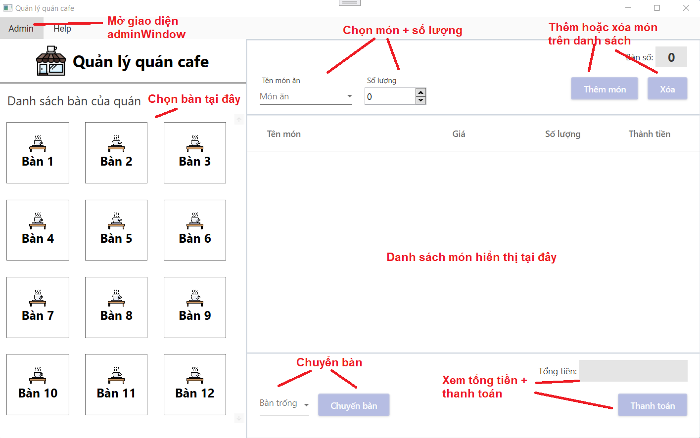
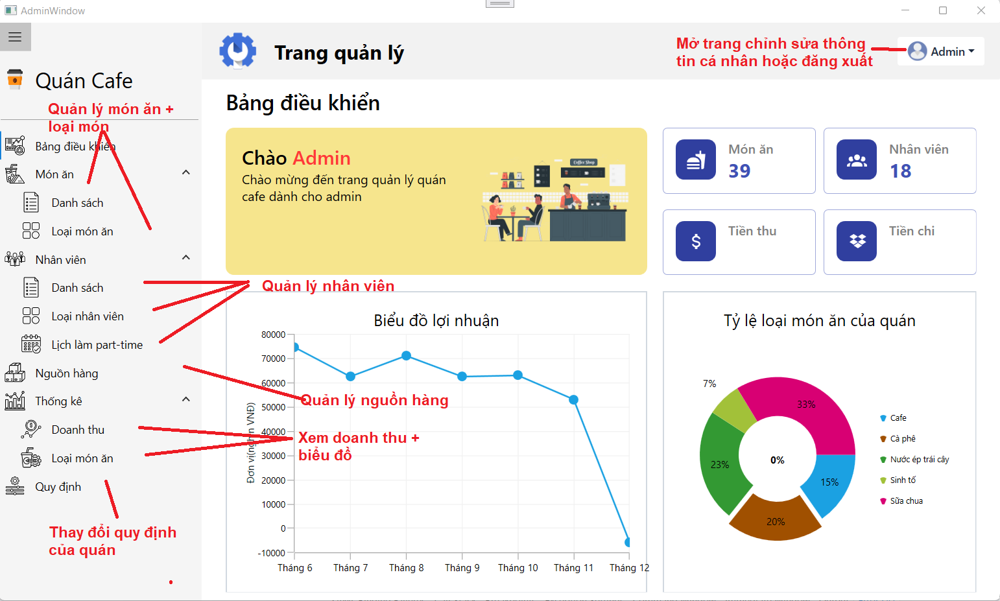
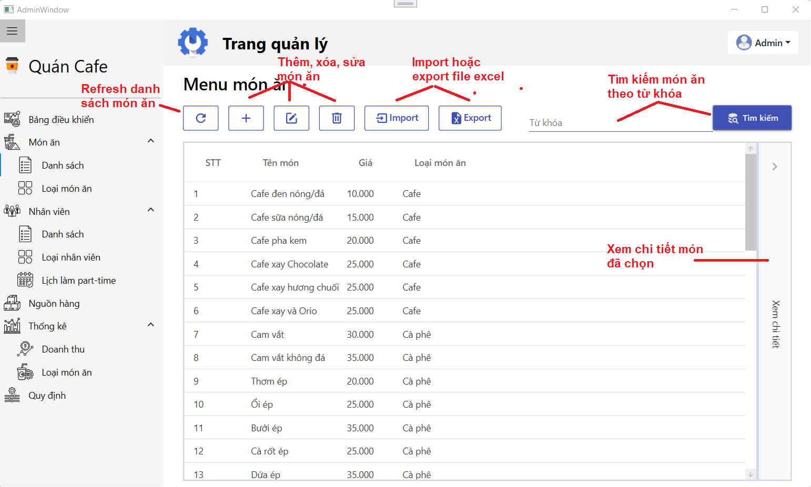
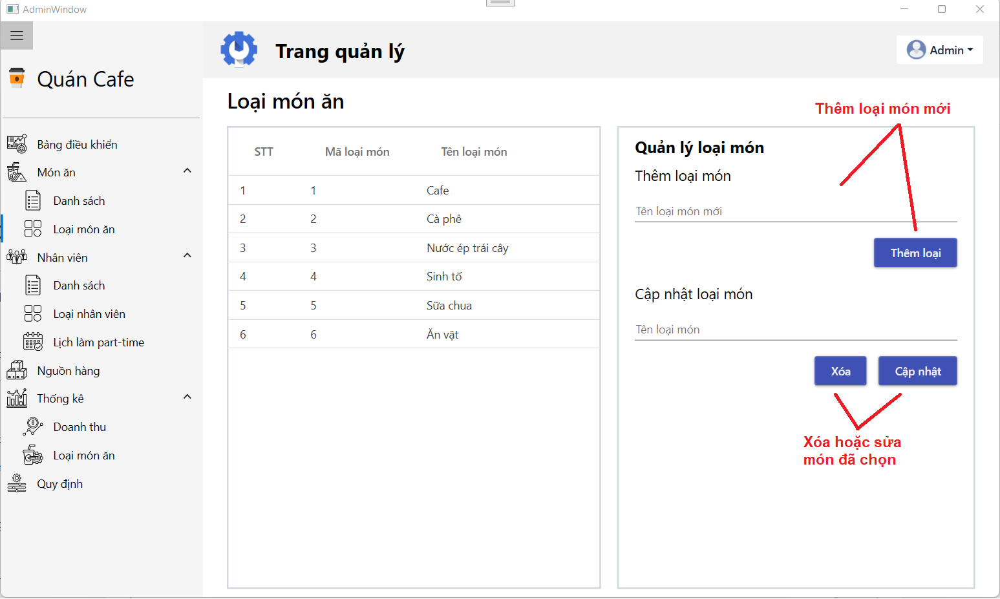
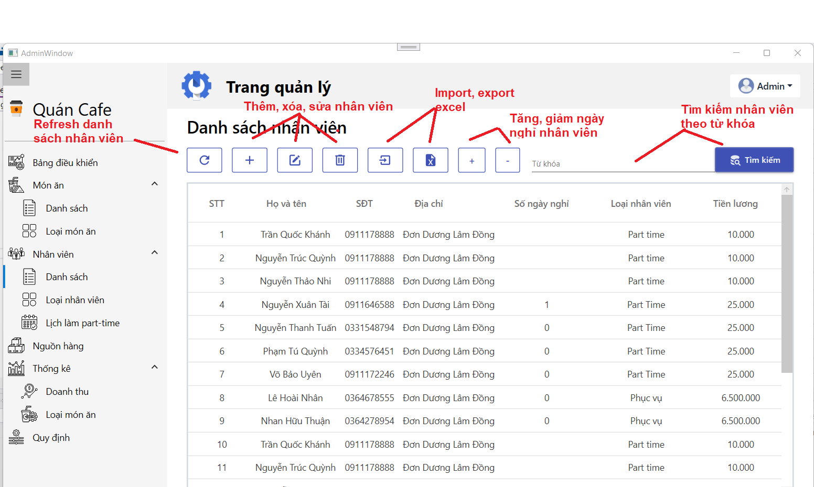
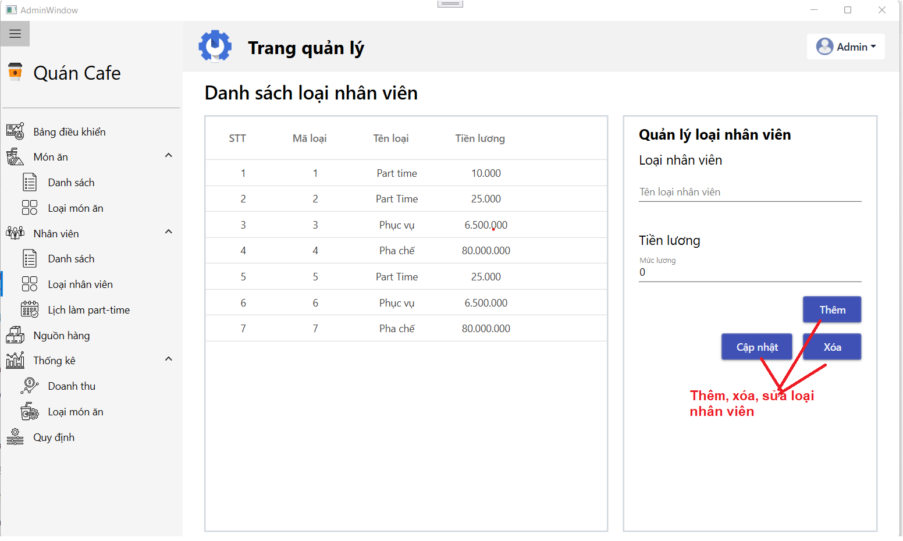
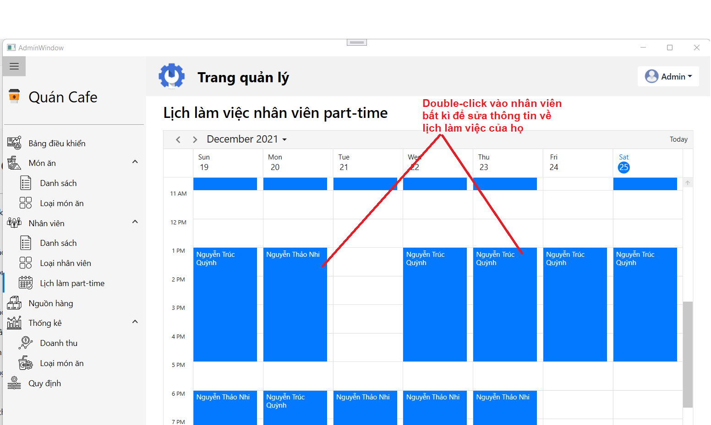
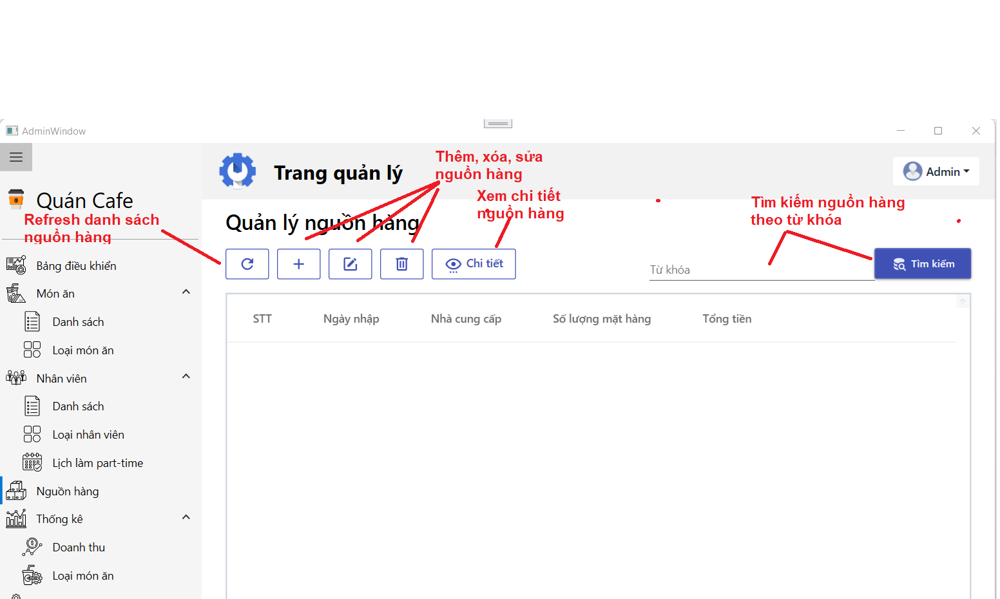
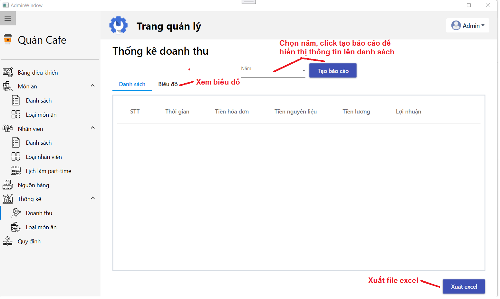
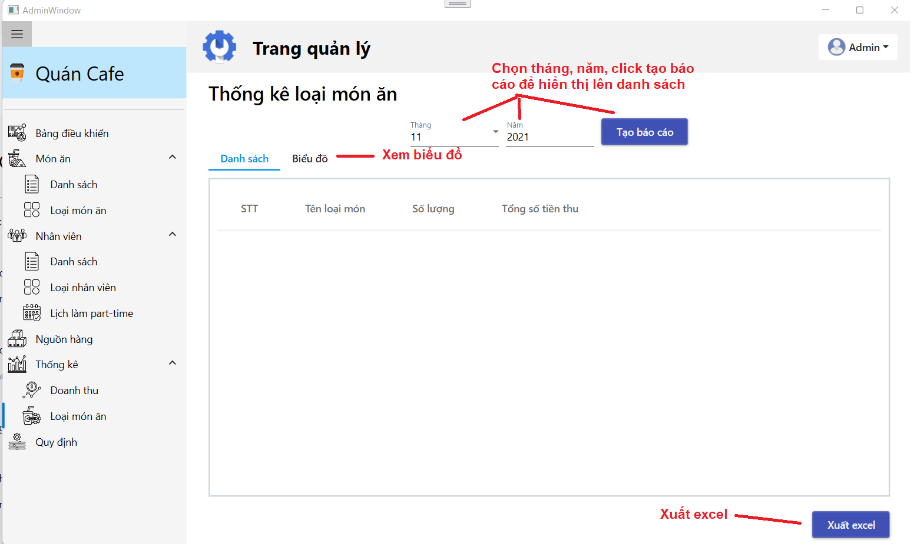
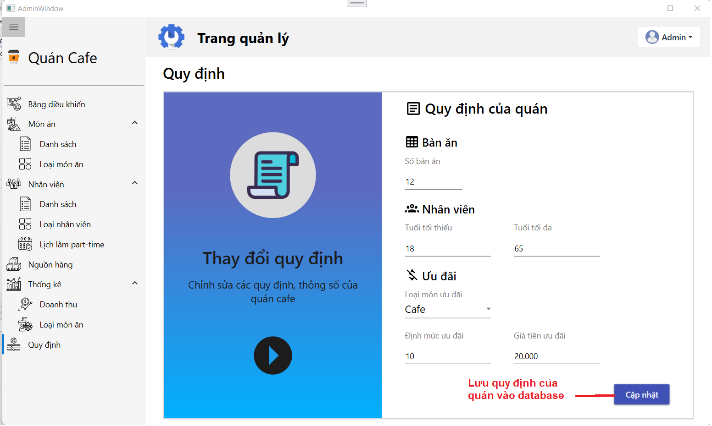
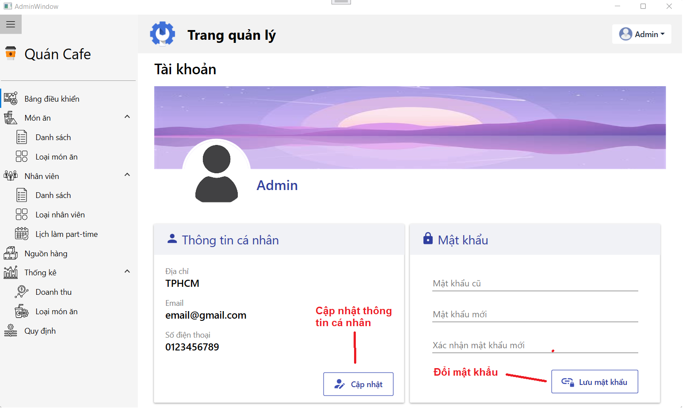

***

**CONTRIBUTORS**

Nhan Hữu Thuận - ChickDev1707 

Nguyễn Xuân Tài - ngxuantai

Trần Quốc Khánh - lancer2672

Nguyễn Thanh Tuấn - 20520846

***

**CÔNG CỤ, THƯ VIỆN**

WPF - C#

MaterialDesign

SyncfusionWPF
